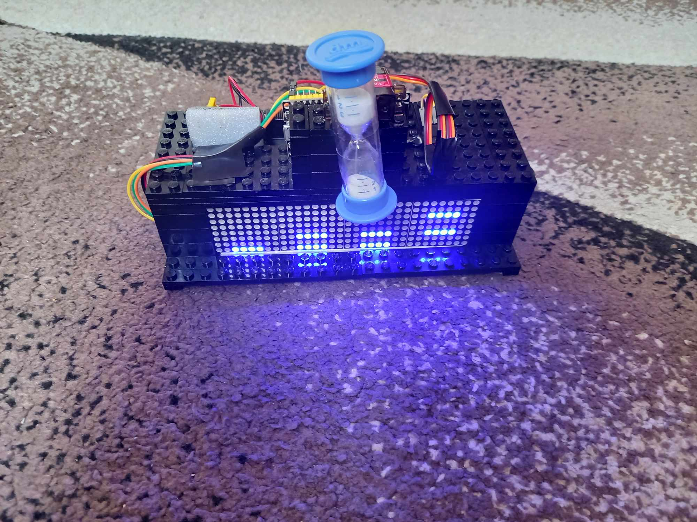
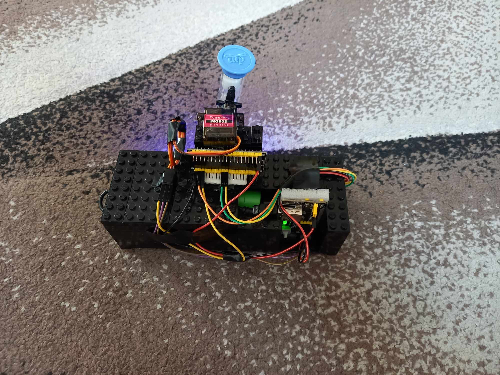

# ESP32-driven clock device

This repository contains source code for a simple clock device controlled by ESP32 microcontroller.

## Appearance

| Front | Back |
|----------|----------|
|      |      |

## Hardware

-   ESP32 microcontroller
-   Jumper wires
-   MG90S servo motor
-   MAX7219 LED display (32 x 8)
-   MB102 power supply module
-   Power bank

Besides that, I mounted a small plastic sand-glass to the servo motor.

## Software

TODO
